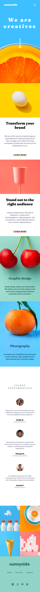

# Frontend Mentor - Sunnyside agency landing page solution

### Links :link:

- [Live site URL](https://vcna-0.github.io/FrontendMentor-challenges/Sunnyside-agency-landing-page/)
- [Solution](https://www.frontendmentor.io/solutions/sunnyside-agency-landing-page-with-html5-flexbox-and-sass-7DFcuLS-7)

## Table of contents

- [Overview](#overview)
  - [The challenge](#the-challenge)
  - [Screenshot](#screenshot)
  - [Links](#links)
- [My process](#my-process)
  - [Built with](#built-with)
  - [What I learned](#what-i-learned)
  - [Useful resources](#useful-resources)
- [Author](#author)

## Overview

### The challenge

Users should be able to:

- View the optimal layout for the site depending on their device's screen size
- See hover states for all interactive elements on the page

### Screenshot

  
Desktop

  

    
  

  
Mobile

  

    
  

## My process

### Built with

- Semantic HTML5 markup
- CSS custom properties
- Flexbox
- Sass

### What I learned

I learned Sass with this project

### Useful resources

- [Sass Guidelines](https://sass-guidelin.es/fr/#architecture) - This helped me to understand more the architecture of Sass

## Author

- Github - [Vcna-0](https://github.com/Vcna-0)
- CodePen - [Vcna-0](https://codepen.io/vcna-0)
- Frontend Mentor - [@Vcna-0](https://www.frontendmentor.io/profile/Vcna-0)
