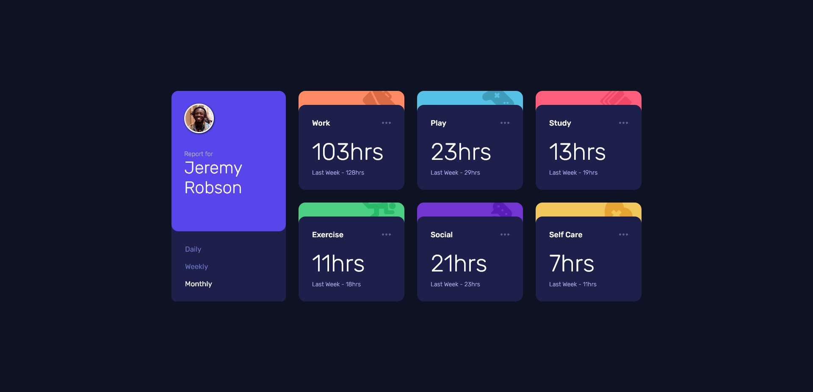
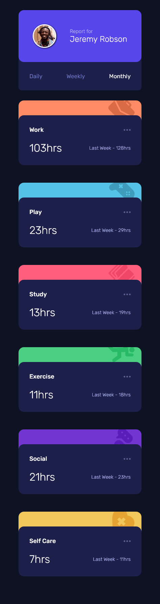

# Frontend Mentor - Time tracking dashboard solution

### Links 🔗

- [Live site URL](https://vcna-0.github.io/FrontendMentor-challenges/Time-tracking-dashboard/)
- [Solution](https://www.frontendmentor.io/solutions/time-tracking-dashboard-with-css-grid-TQ6uh7z95)

## Table of contents

- [Overview](#overview)
  - [The challenge](#the-challenge)
  - [Screenshot](#screenshot)
  - [Links](#links)
- [My process](#my-process)
  - [Built with](#built-with)
- [Author](#author)
- [Acknowledgments](#acknowledgments)

## Overview

### The challenge

Users should be able to:

- View the optimal layout for the site depending on their device's screen size
- See hover states for all interactive elements on the page
- Switch between viewing Daily, Weekly, and Monthly stats

### Screenshot

  
Desktop

  

    
  

  
Mobile

  

    
  

## My process

### Built with

- Semantic HTML5 markup
- CSS custom properties
- CSS Grid
- Javascript

## Author

- Github - [Vcna-0](https://github.com/Vcna-0)
- CodePen - [Vcna-0](https://codepen.io/vcna-0)
- Frontend Mentor - [@Vcna-0](https://www.frontendmentor.io/profile/Vcna-0)
